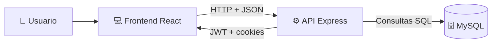

# 📚 GoblinVerse — Documentación del Proyecto

Plataforma full-stack para descubrir y gestionar libros dentro de un universo fantástico.
Incluye **frontend en React**, **backend en Node + Express**, autenticación con **JWT + refresh tokens**, y persistencia en **MySQL**.

---

## Indice

- [Vision general](#vision-general)
- [Arquitectura general](#arquitectura-general)
- [Tecnologias utilizadas](#tecnologias-utilizadas)
- [Frontend](#frontend)
- [Backend](#backend)
- [Estructura del proyecto](#estructura-del-proyecto)
- [Frontend (React)](#frontend-react)
- [Rutas principales](#rutas-principales)
- [Pagina Principal (`/`)](#pagina-principal)
- [Catalogo (`/catalogo`)](#catalogo)
- [Pagina del libro (`/libro/:id`)](#pagina-del-libro-libroid)
- [Perfil (`/perfil`)](#perfil)
- [Carrito (`/carrito`)](#carrito)
- [Sobre Nosotros (`/sobreNosotros`)](#sobre-nosotros)
- [Contacto (`/contacto`)](#contacto)
- [Pantalla de Login / Registro (`/login`)](#pantalla-de-login--registro-login)
- [Componentes compartidos](#componentes-compartidos)
- [Backend (Node + Express)](#backend-node--express)
- [Configuracion del servidor](#configuracion-del-servidor)
- [Conexion a base de datos](#conexion-a-base-de-datos)
- [Endpoints de la API](#endpoints-de-la-api)
- [Middleware de autenticacion](#middleware-de-autenticacion)
- [Script de seed de libros](#script-de-seed-de-libros)
- [Modelo de datos](#modelo-de-datos)
- [Flujo de autenticacion](#flujo-de-autenticacion)
- [Variables de entorno](#variables-de-entorno)
- [Puesta en marcha](#puesta-en-marcha)
- [Testing y calidad](#testing-y-calidad)
- [Roadmap y mejoras futuras](#roadmap-y-mejoras-futuras)
---

<a id="vision-general"></a>
## Vision general

**GoblinVerse** es una aplicación web que simula la experiencia de una librería fantástica:

- **Frontend**: Single Page Application (SPA) en React con:
  - Página principal con catálogo de libros destacados.
  - Exploración por géneros con tarjetas visuales.
  - Pantalla de **login/registro** moderna y responsiva.
  - Vistas de **catálogo completo**, **perfil de usuario**, **carrito**, **sobre nosotros** y **contacto**.
- **Backend**: API REST en Node + Express que ofrece:
  - **Registro** de usuarios.
  - **Login** con generación de access token y refresh token.
  - **Refresco de token** usando cookies HTTP-Only.
  - Endpoints para **usuarios**, **favoritos**, **compras**, **carrito** y **libros**.
- **Base de datos**: MySQL para almacenar usuarios, tokens y catálogo.

El objetivo es tener una base sólida para evolucionar hacia una **librería online completa** con rutas protegidas, carrito de compra y gestión avanzada de usuarios.

---

## 🆕 Novedades recientes (2026-03-18)

- **Página Sobre Nosotros** completa con historia, misión, visión y valores.
- **Página Contacto** con email (redirige a Gmail), teléfono, dirección, redes sociales y horario.
- **Carrito funcional completo**: listado, cantidades, totales, eliminación y cálculo de envío.
- **Checkout con Stripe (modo test)**: creación de PaymentIntent + Stripe Elements + redirección a confirmación.
- **Registro de compras tras pago exitoso**: inserción en tabla `compra` y control de `401` (login requerido).
- **Tests implementados**: login, header, utils, funtionGenres y cerrarSesion.
- **Responsive mejorado** en catálogo, perfil y páginas nuevas.
- **Navegación por géneros** desde la home al catálogo filtrado.

---

<a id="arquitectura-general"></a>
## Arquitectura general

Arquitectura en tres capas:

- **Cliente (React)**

  - Se ejecuta en `http://localhost:3000`.
  - Consume la API del backend mediante `fetch`.
- **Servidor (Express)**

  - Se ejecuta en `http://localhost:5000`.
  - Expone rutas de autenticación, usuarios y libros.
  - Aplica CORS con `credentials: true` para permitir cookies.
- **Base de datos (MySQL)**

  - BD `basedatosProyecto`.
  - Tablas principales: `usuarios`, `libros`, `favoritos`, `compra`, `carrito`.

Puedes imaginarlo así:



---

<a id="tecnologias-utilizadas"></a>
## Tecnologias utilizadas

<a id="frontend"></a>
### Frontend

- ⚛️ **React** `^19.2.3`
- 🛣️ **React Router DOM** `^7.12.0` — Navegación SPA.
- 🎨 **Renderizado 3D**:
  - `three`
  - `@react-three/fiber`
  - `@react-three/drei`
- 🧪 **Testing Library**:
  - `@testing-library/react`
  - `@testing-library/jest-dom`
  - `@testing-library/user-event`
  - `@testing-library/dom`
  - `jsdom`
- 📊 **web-vitals** — métricas de rendimiento.
- 💅 **Tailwind CSS** `^3.4.19`.
- 🍞 **react-hot-toast** — notificaciones toast.
- 💳 **Stripe**:
  - `@stripe/stripe-js`
  - `@stripe/react-stripe-js`
- Otros:
  - `i18next-browser-languagedetector` (preparado para i18n).
  - `jquery`
  - `jsonwebtoken`

<a id="backend"></a>
### Backend

- 🟢 **Node.js + Express** `^4.18.2`
- 🔐 **jsonwebtoken** — generación y validación de JWT.
- 🔒 **bcryptjs** — hashing de contraseñas.
- 🍪 **cookie-parser** — lectura de cookies (`refreshToken`).
- 🌐 **cors** — configuración CORS con credenciales.
- 🐬 **mysql2/promise** — conexión con MySQL.
- 📝 **dotenv** — gestión de variables de entorno.
- 🌐 **axios** — usado en seeding de libros.
- 💳 **stripe** — creación de PaymentIntents.
- 🗄️ Preparado para sesiones en Redis:
  - `express-session`
  - `connect-redis`
  - `redis`

<a id="estructura-del-proyecto"></a>
## Estructura del proyecto

```text
proyectode0/
+- package.json
+- README.md
+- DOCUMENTACION_COMPLETA.md
+- 📊 Evaluación General Proyecto.md
+- backend/
|  +- package.json
|  +- server.js
|  +- .env
|  +- config/
|  |  +- db.js
|  |  +- seedLibros.js
|  +- controllers/
|  |  +- authController.js
|  |  +- registerController.js
|  |  +- refreshTokenController.js
|  |  +- usersController.js
|  |  +- librosController.js
|  |  +- cartController.js
|  +- middleware/
|  |  +- auth.middleware.js
|  +- routes/
|     +- auth.js
+- src/
   +- index.js
   +- App.js
   +- Pages/
   |  +- Principal/principal.jsx
   |  +- Login/login.jsx
   |  +- Catalogo/catalogo.jsx
   |  +- Perfil/perfil.jsx
   |  +- Libros/paginaLibro.jsx
   |  +- Carrito/carrito.jsx
   |  +- Sobre Nosotros/sobreNosotros.jsx
   |  +- Contacto/contacto.jsx
   +- Components/
   |  +- Header/header.jsx
   |  +- Footer/footer.jsx
   |  +- MiPerfil/miPerfil.jsx
   |  +- MisCompras/misCompras.jsx
   |  +- LibrosDestacados/librosDestacados.jsx
   |  +- Login-Registro/
   +- Services/
   |  +- funtionGenres.js
   |  +- cerrarSesion.js
   +- utils/
   |  +- utils.js
   +- Context/
      +- AuthContext.js
```

---

<a id="frontend-react"></a>
## Frontend (React)

<a id="rutas-principales"></a>
### Rutas principales

En `App.js` se definen las rutas:

- `/` → `Principal`.
- `/login` → `Login`.
- `/perfil` → `Perfil`.
- `/libro/:id` → `PageBook`.
- `/catalogo` → `Catalogo`.
- `/carrito` → `Carrito`.
- `/sobreNosotros` → `SobreNosotros`.
- `/contacto` → `Contacto`.

<a id="pagina-principal"></a>
### Pagina Principal (`/`)

**Componente:** `Principal`

- Fondo oscuro temático y layout responsive.
- Botón "Explorar Catálogo" que navega a `/catalogo`.
- Sección "Nuestras gemas destacadas":
  - Llama a `POST /librosPublicos`.
  - Renderiza libros con componente 3D `Libro3D`.
- Sección de géneros usando `generosArray`.
- Al pulsar un género, navega a `/catalogo` con el filtro aplicado.
- Incluye `Header` y `Footer`.

<a id="catalogo"></a>
### Catalogo (`/catalogo`)

**Componente:** `Catalogo`

- Llama a `POST /libros` para traer catálogo completo.
- Filtro por título con `POST /libroTitulo`.
- Filtro por géneros con `POST /librosFiltrados`.
- Limpia filtros al recargar o al entrar desde el link "Catálogo".
- Renderiza tarjetas de libros en 3D y panel de filtros responsive.

<a id="pagina-del-libro-libroid"></a>
### Pagina del libro (`/libro/:id`)

**Componente:** `PageBook`

- Botón **"Resumen"** debajo del canvas que lee la descripción con voz.
- Selección automática de la mejor voz disponible en español.
- Añadir al carrito y a favoritos.

<a id="perfil"></a>
### Perfil (`/perfil`)

**Componente:** `Perfil`

- Dashboard con menú lateral.
- Alterna entre:
  - `MiPerfil`: datos del usuario, favoritos y métricas.
  - `MisCompras`: historial de compras.
- Cierre de sesión vía `POST /cerrarSesion` y borrado de token local.
- Renovación automática de token (`POST /refresh`) cuando una ruta protegida responde `401`.
- Tarjetas de estadísticas apiladas en móvil y favoritos centrados en pantallas pequeñas.

<a id="carrito"></a>
### Carrito (`/carrito`)

**Componente:** `Carrito`

- Carga libros desde `POST /librosCarrito`.
- Permite incrementar o disminuir cantidades.
- Eliminar libros del carrito.
- Calcula subtotal y total con envío fijo.
- Si el token expira, usa `renovarToken()`.

<a id="sobre-nosotros"></a>
### Sobre Nosotros (`/sobreNosotros`)

**Componente:** `SobreNosotros`

- Página completa con:
  - Historia de GoblinVerse.
  - Misión y Visión.
  - Valores (Pasión sin límites, Comunidad unida, Calidad curada).
- Diseño responsive con tarjetas y secciones diferenciadas.

<a id="contacto"></a>
### Contacto (`/contacto`)

**Componente:** `Contacto`

- Información de contacto:
  - Email (clickeable, redirige a Gmail).
  - Teléfono.
  - Dirección física.
- Redes sociales (Instagram, Twitter, Facebook, TikTok).
- Horario de atención.
- Diseño responsive con tarjetas interactivas.

<a id="pantalla-de-login--registro-login"></a>
### Pantalla de Login / Registro (`/login`)

**Componente:** `Login`

- Usa `useState` para alternar entre login y registro.
- **Login** (`BotonEnviarLogin`):
  - `POST http://localhost:5000/login`
  - Guarda `token` en `localStorage`.
  - Navega a `/`.
- **Registro** (`BotonEnviarRegistro`):
  - `POST http://localhost:5000/register`
  - Redirige a `/login` si va bien.
- UI lista para futura integración OAuth (Google/Facebook).

<a id="componentes-compartidos"></a>
### Componentes compartidos

- **Header (`Header`)**:

  - Navegación principal.
  - El link "Catálogo" entra con filtros limpios.
  - Botón de usuario dinámico:
    - Con token → `/perfil`.
    - Sin token → `/login`.
  - Botón de carrito que navega a `/carrito`.
- **Footer (`Footer`)**:

  - Pie con copyright del proyecto.
- **Servicios y utilidades**:

  - `Services/funtionGenres.js`: géneros e imágenes.
  - `Services/cerrarSesion.js`: cierre de sesión.
  - `utils/utils.js`:
    - `renovarToken()`
    - `Libro3D`
  - `Services/api.js` y `Context/AuthContext.js`: base preparada para evolución futura.

---

<a id="backend-node--express"></a>
## Backend (Node + Express)

<a id="configuracion-del-servidor"></a>
### Configuracion del servidor

Archivo: `backend/server.js`

- Crea app Express.
- Middleware:
  - `cors({ origin: 'http://localhost:3000', credentials: true })`
  - `express.json()`
  - `cookieParser()`
- Monta rutas con `app.use('/', authRoutes)`.
- Puerto `5000`.

<a id="conexion-a-base-de-datos"></a>
### Conexion a base de datos

Archivo: `backend/config/db.js`

- Usa `mysql2/promise`.
- Configuración actual:
  - host: `127.0.0.1`
  - port: `3306`
  - user: `root`
  - password: (definida en archivo)
  - database: `basedatosProyecto`
- Exporta `conexionBD()`.

<a id="endpoints-de-la-api"></a>
### Endpoints de la API

Archivo: `backend/routes/auth.js`

- `POST /login` → login de usuario.
- `POST /register` → registro de usuario.
- `POST /refresh` → refresco de access token.
- `POST /usuarios` → datos del usuario por token (**protegida**).
- `POST /librosPublicos` → 6 libros destacados.
- `POST /libros` → listado completo de libros.
- `POST /libroTitulo` → búsqueda por título.
- `POST /librosFiltrados` → filtrado por géneros.
- `POST /libroId` → detalle de libro por ID.
- `POST /librosFavoritos` → favoritos del usuario (**protegida**).
- `POST /anadirFavorito` → añadir a favoritos (**protegida**).
- `POST /librosComprados` → compras del usuario (**protegida**).
- `POST /eliminarLibro` → elimina favorito por id (**protegida**).
- `POST /anadirLibroCarrito` → añadir al carrito (**protegida**).
- `POST /librosCarrito` → ver carrito (**protegida**).
- `POST /eliminarLibroCarrito` → eliminar del carrito (**protegida**).
- `POST /guardarLibroCarrito` → registrar compra de un libro (**protegida**).
- `POST /registrarCompraCarrito` → registrar compras desde carrito (**protegida**).
- `POST /cerrarSesion` → invalida refresh token y limpia cookie.

Archivo: `backend/routes/pagos.js`

- `POST /api/pagos/intentoPago` → crea un `PaymentIntent` y devuelve `client_secret`.

<a id="middleware-de-autenticacion"></a>
### Middleware de autenticacion

Archivo: `backend/middleware/auth.middleware.js`

- Espera `Authorization: Bearer <ACCESS_TOKEN>`.
- Verifica JWT con `JWT_SECRET`.
- Si es válido:
  - carga `req.user`
  - carga `req.id_usuario`
  - ejecuta `next()`
- Si falla:
  - `401` con `Token requerido`, `Token expirado` o `Token inválido`.

<a id="script-de-seed-de-libros"></a>
### Script de seed de libros

Archivo: `backend/config/seedLibros.js`

- Consulta Open Library (`q=fiction&limit=50`).
- Inserta/actualiza libros en `libros` usando ISBN.
- Usa `ON DUPLICATE KEY UPDATE` para evitar duplicados.

Ejecución:

```bash
cd backend
node config/seedLibros.js
```

---

<a id="modelo-de-datos"></a>
## Modelo de datos

Basado en las consultas reales del backend, el proyecto usa al menos estas tablas:

### `usuarios`

- `id_usuario` (PRIMARY KEY, AUTO_INCREMENT)
- `nombre_usuario` (VARCHAR)
- `gmail` (VARCHAR UNIQUE)
- `contrasena` (VARCHAR, hash bcrypt)
- `token` (TEXT/VARCHAR)

### `libros`

- `id_libro` (PRIMARY KEY, AUTO_INCREMENT)
- `isbn` (VARCHAR)
- `titulo`
- `autor`
- `categoria`
- `editorial`
- `existencias`
- `url_imagen`
- `descripcion`
- `idioma`
- `precio`

### `favoritos`

- `id_favorito` (PRIMARY KEY)
- `id_user` (FK a `usuarios.id_usuario`)
- `id_libro` (FK a `libros.id_libro`)
- `fecha`

### `compra`

- `id_compra` (PRIMARY KEY)
- `id_user` (FK a `usuarios.id_usuario`)
- `id_libro` (FK a `libros.id_libro`)
- `fecha`

### `carrito`

- `id_carrito` (PRIMARY KEY)
- `id_user` (FK a `usuarios.id_usuario`)
- `id_libro` (FK a `libros.id_libro`)
- `cantidad` (opcional; actualmente las cantidades se gestionan en frontend y el backend guarda 1 fila por libro)
- `fecha`

---

<a id="flujo-de-autenticacion"></a>
## Flujo de autenticacion

1. **Registro** 📝

   - Usuario completa formulario en `/login` (modo registro).
   - Front envía `POST /register`.
2. **Login** 🔐

   - Front envía `POST /login`.
   - Backend genera access token + refresh token.
   - Guarda refresh en BD y cookie HTTP-Only.
   - Front guarda access token en `localStorage`.
3. **Acceso a rutas protegidas** 🔓

   - Front envía `Authorization: Bearer <ACCESS_TOKEN>`.
4. **Refresco de token** 🔄

   - Si hay `401`, el front llama `POST /refresh` con `credentials: 'include'`.
   - Si refresh es válido, guarda nuevo access token y reintenta petición.
5. **Cierre de sesión** 👋

   - Front llama `POST /cerrarSesion`.
   - Backend limpia token en BD y borra cookie `refreshToken`.

---

<a id="variables-de-entorno"></a>
## Variables de entorno

Definidas en `.env` (frontend) y `backend/.env` (backend).

```bash
# Frontend (.env)
REACT_APP_STRIPE_PUBLIC_KEY=pk_test_...

# Backend (backend/.env)
JWT_SECRET=tu_clave_super_secreta_para_access
JWT_REFRESH_SECRET=tu_clave_super_secreta_para_refresh
JWT_EXPIRES_IN=15m
JWT_REFRESH_EXPIRES_IN=7d
STRIPE_SECRET_KEY=sk_test_...
```

---

<a id="puesta-en-marcha"></a>
## Puesta en marcha

### Requisitos previos

- Node.js (LTS recomendado).
- MySQL local.

### 1️⃣ Backend

```bash
cd backend
npm install
npm run dev
```

### 2️⃣ Frontend

```bash
cd ..
npm install
npm start
```

### 3️⃣ Seed opcional de libros

```bash
cd backend
node config/seedLibros.js
```

---

<a id="testing-y-calidad"></a>
## Testing y calidad

Dependencias incluidas para pruebas frontend:

- `@testing-library/react`
- `@testing-library/jest-dom`
- `@testing-library/user-event`
- `@testing-library/dom`
- `jsdom`

Tests implementados:
- `src/Pages/Login/login.test.js` — Tests de login.
- `src/Components/Header/header.test.js` — Tests del header.
- `src/utils/utils.test.js` — Tests de utilidades.
- `src/Services/funtionGenres.test.js` — Tests de géneros.
- `src/Services/cerrarSesion.test.js` — Tests de cierre de sesión.

Ejecución:

```bash
npm test
```


---

Con todo lo anterior, este README documenta el estado actual del proyecto y las piezas nuevas ya implementadas.
